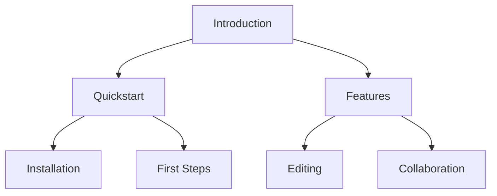

## Overview

ITBot empowers you to build comprehensive documentation sites with intuitive tools. You create pages, organize them hierarchically, edit rich content, collaborate in real-time, and search efficiently. These core features streamline your workflow from initial setup to ongoing maintenance.

<Columns cols={2}>
  <Card title="Page Organization" icon="layout" href="#page-organization">
    Structure your docs with nested pages and intuitive navigation.
  </Card>
  <Card title="Rich Editing" icon="edit-3" href="#rich-editing">
    Embed media, code, and components effortlessly.
  </Card>
  <Card title="Collaboration" icon="users" href="#collaboration">
    Work together with comments and live updates.
  </Card>
  <Card title="Search Tools" icon="search" href="#search-tools">
    Find content quickly with advanced filtering.
  </Card>
</Columns>

## Page Creation and Hierarchical Organization

You start by creating pages directly in ITBot's editor. Each page supports nested children, forming a tree-like structure for logical navigation. Use the sidebar to drag and drop pages, ensuring your docs follow a clear hierarchy like `/introduction` > `/quickstart` > `/authentication`.



<Steps>
  <Step title="Create a Page" icon="plus">
    Click the `{+ New Page}` button in the sidebar.
    
    Enter a title like "API Reference" and select a parent page.
  </Step>
  <Step title="Organize Hierarchy" icon="move">
    Drag pages in the sidebar to nest them.
    
    Preview navigation changes live.
  </Step>
  <Step title="Publish Changes" icon="upload">
    Hit `{Publish}` to update your live site.
  </Step>
</Steps>

<Callout kind="tip">
  Use short, descriptive slugs for URLs, like `/api/endpoints`, to improve SEO and usability.
</Callout>

## Rich Text Editing and Media Embedding

ITBot's editor supports Markdown, MDX components, and embeds. You add images, videos, code blocks, and custom JSX seamlessly. Syntax highlighting works for 100+ languages, and previews render instantly.

<Tabs>
  <Tab title="Image Embedding" icon="image">
    Drag and drop images or use the embed menu.
    
````markdown

````
  </Tab>
  <Tab title="Code Blocks" icon="code">
    Highlight syntax with language tags.
    
    <CodeGroup tabs="JavaScript,Python">
````javascript
const apiKey = 'YOUR_API_KEY';
fetch('https://api.example.com/docs', {
  headers: { Authorization: `Bearer ${apiKey}` }
});
````
````python
import requests

response = requests.get(
    'https://api.example.com/docs',
    headers={'Authorization': 'Bearer YOUR_API_KEY'}
)
````
    </CodeGroup>
  </Tab>
  <Tab title="Video" icon="video">
    Embed from YouTube or self-host.
    
````jsx
<Video
  src="https://www.youtube.com/embed/dQw4w9WgXcQ"
  title="ITBot Demo"
  width="560"
  height="315"
/>
````
  </Tab>
</Tabs>

## Real-Time Collaboration and Comments

Invite team members to edit simultaneously. Changes sync instantly, with presence indicators showing who's active. Add threaded comments on any block for feedback.

<Callout kind="info">
  Enable version history to revert changes or compare edits.
</Callout>

To collaborate:

1. Share a page link with `{view}` or `{edit}` permissions.
2. @mention users in comments: `@team-member Review this section`.
3. Resolve comments once addressed.

## Search and Filtering Tools

ITBot's global search indexes all content. Filter by tags, page type, or date. Advanced queries support Boolean operators like `{docs AND api}`.

<Expandable title="Advanced Search Syntax" default-open="false">
  Use these operators:
  
  | Operator | Example | Result |
  |----------|---------|--------|
  | `AND` | `features AND collaboration` | Pages with both terms |
  | `OR` | `edit OR search` | Pages with either term |
  | `"` | `"real-time editing"` | Exact phrase match |
  | `-` | `docs -draft` | Exclude drafts |

  Tag-based filtering: `tag:feature`.
</Expandable>

These features make ITBot your go-to for scalable documentation. Start building by [creating your first page](/quickstart).